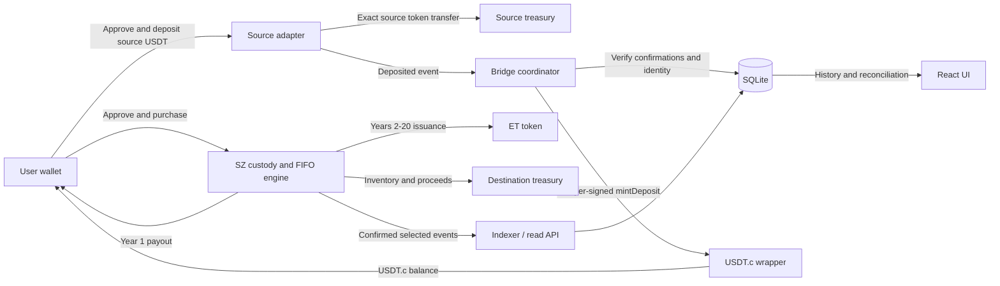

# Swiz Smart — Developer Guide

**Version:** 1.0 · **Implementation snapshot:** 2 September 2026

**Audience:** frontend, smart-contract, backend, QA and deployment engineers.

**Basis:** the supplied “Token Development Inputs and Scope Confirmation” v1.1, the current repository implementation, and the validation recorded during implementation and UI restoration.

## 1. Purpose, authority and delivery status

This guide explains how the implemented Swiz Smart dApp works, how to run and deploy it, and where the delivered behavior differs from a fully accepted production baseline. The repository contains a responsive React frontend, four production contract types, a managed bridge coordinator, and a SQLite-backed event indexer/API.

The supplied v1.1 document references Specification v2.1, but a separate complete copy of v2.1 was not supplied for this guide. References below identify the named sections of v1.1 because its item numbering repeats. Statements framed there as recommendations or requests for confirmation remain assumptions unless explicitly confirmed in the supplied text. This guide does not constitute client acceptance or an independent security certification.

The current code implements the selected baseline and restores the previous red glass UI. Local contract/backend verification and UI checks are recorded. Final economic inputs, production deployment, independent mainnet token/confirmation verification, and live Base Sepolia plus three-source UAT remain outstanding. Previous deployed contract addresses are incompatible with the replacement implementation.

At the final documentation check, the local frontend was using Polygon Amoy fallback configuration, while no backend `.env` or deployment configuration was present and no backend was listening on port 5001. This prevents source-network discovery and live deposits. The frontend now handles HTML, malformed JSON and unavailable backend responses without exposing parser errors; the network selector stays disabled until valid configuration loads. This UI correction does not provision the missing bridge deployment.

Use the active source files and generated ABIs as the implementation authority. Older architecture documents, ZIP archives, Polygon Amoy deployment artifacts, and `Backend/data_store.json` are historical material. Do not use them as the current deployment or transaction ledger. The retained `scripts/deployAmoyAll.ts` is also obsolete: it reuses historical addresses and supplies a mock token as SZ collateral instead of the new wrapper. Use the destination/source deployment scripts in this guide.

The companion `IMPLEMENTATION_SNAPSHOT.json` records SHA-256 hashes of the reviewed implementation files. No Git revision is asserted because the inspected folder has no Git repository metadata. All paths in this guide are relative to the repository root unless a command states otherwise.

## 2. Architecture and repository map

The browser reads authoritative balances, package state and prices directly from the destination RPC. It submits signed transactions through the connected wallet. The backend supplies confirmed event history and deposit reconciliation; it does not accept a browser assertion that a purchase succeeded.



| Location | Responsibility |
| --- | --- |
| `smartContract/contracts/SZToken.sol` | Fixed SZ supply, package custody, pricing, FIFO matching, offline sales and migration |
| `smartContract/contracts/EcosystemToken.sol` | Transferable ET; permanent one-time minter binding and optional cap |
| `smartContract/contracts/USDTcWrapper.sol` | Managed destination minting, source allowlist, duplicate protection and pause |
| `smartContract/contracts/SourceDepositAdapter.sol` | Approved source-token deposits directly to the configured treasury |
| `smartContract/contracts/mocks/MockUSDT.sol` | Local/test token only; exclude from production token selection |
| `smartContract/scripts/` | Deployment, source registration, ABI export and local integration verification |
| `Backend/src/bridge.js` | Source scanning, attestation checks, destination minting and recovery |
| `Backend/src/protocol.js` | Direct chain reader and selected SZ event indexer |
| `Backend/src/db/index.js` | SQLite schema, cursors and idempotent records |
| `Backend/src/routes/api.js` | Public read API and retired write endpoints |
| `frontEnd/src/context/Web3Context.tsx` | RPC reads, wallet actions, allowances and receipt handling |
| `frontEnd/src/components/ProtocolOperations.tsx` | History, deposit reconciliation and administrative forms |
| `frontEnd/src/hooks/useUiData.ts` | Presentation adapter for the restored UI |
| `config/deployment.example.json` | Reviewed destination/source network configuration template |

**Runtime baseline.** Root and backend manifests require Node.js 24 or newer. The repository uses Solidity 0.8.28, Hardhat 3, OpenZeppelin 5, ethers 6, Express 4, React 19, TypeScript 6, Vite 8, Tailwind 4 and Reown AppKit. Consult each `package-lock.json` for resolved versions; the package manifests contain version ranges. The backend uses Node’s built-in `node:sqlite` module.

**Trust boundaries.** The company controls treasury custody and administration. A separate relayer attests to source deposits. The wrapper checks the relayer role, registered source identity and unique nonce-derived ID; it does not verify a cryptographic source-chain proof. A compromised relayer can submit false attestations. Role separation, key protection, reviewed RPCs and reconciliation are therefore part of the operating model.

## 3. SOW-to-implementation traceability

“Implemented” means present in reviewed code, not deployed or client-approved. “Partial” identifies delivered behavior with a material remaining gap. “Pending” requires configuration, acceptance or external work.

| v1.1 requirement | Implementation reference / behavior | Status |
| --- | --- | --- |
| §2A: UW/AW model; ET to original staker | `SZToken._match`; no Ecosystem Wallet field | Implemented |
| §1B: six-decimal fixed SZ supply | `SZToken` constructor and `decimals`; treasury receives initial supply | Implemented; final supply pending |
| §1B: no routine SZ mint or burn | No external mint/burn entry point | Implemented |
| §2B: additive price thresholds | `_calculatePrice`, `purchase`, `_create` | Implemented |
| §1C/§2C: one purchase, one locked package | `purchase` creates one package; no ownership reassignment | Implemented |
| §2C: 20 annual tranches; final remainder | `trancheQuantity`, `getUnlockSchedule` | Implemented |
| §2D/§3A: automatic FIFO eligibility | Next-tranche heap; retained contract custody | Implemented assumption: no direct withdrawal |
| §2D: partial fills and 100× cap | `_match`, `trancheBoughtBack` | Implemented; spread treatment needs acceptance |
| §2D–E: Year 1 USDT.c; Years 2–20 ET | Atomic payout branches; `EcosystemToken.mint` | Implemented; 1:1 ET rate assumed |
| §3D: administrator-funded buyback | Funding, execution and withdrawal methods | Implemented assumption |
| §2F: approved-token one-way deposits | Source adapter plus managed relayer/wrapper | Implemented; live network setup pending |
| §1D: min/max deposits and fees | Adapter limits configurable; fee fixed at zero in current behavior | Limits implemented; economics pending |
| §2F: duplicate protection and recovery | Deposit IDs, on-chain processed flag and SQLite states | Implemented; manual incident handling limited |
| §1E/§3E: historical purchaser migration | `importHistoricalSale` and dated offline-sale struct | Contract and JSON form implemented; CSV import absent |
| §2G: responsive wallet dApp | Reown connector and restored Home/Buy/Dashboard/Admin screens | Implemented; live wallet UAT pending |
| §2G: package, unlock, payout and price data | Direct RPC reads; schedule and ET views | Implemented |
| §2G: history and reconciliation | Public API, SQLite records and UI tables | Partial: selected events, latest 500 records |
| §2G–H: role-protected administration | On-chain roles; frontend forms for destination controls | Implemented; source controls use contract tooling |
| §1A: approved branding/support/legal material | Restored prior design; optional footer configuration | Final assets, links and legal text pending |
| §4: future production L2 and hosting | Configurable RPC/scripts; frontend network list requires extension | Pending production details and validation |

### 3.1 Assumptions requiring economic or operational acceptance

- Unlocked SZ remains in the staking contract until bought back; no user withdrawal or early cancellation exists.
- One dollar of substituted payout produces one ET. This is an internal issuance calculation, not redemption or market-value backing.
- ET is uncapped when `ET_MAX_SUPPLY=0`; another cap can be chosen before deployment.
- Administrator-funded buybacks and genuine historical timestamps are enabled.
- Source wrapper fee is zero. No configurable nonzero fee mechanism is implemented.
- UAT purchase limits default to 1–100,000 USDT.c; active packages per wallet default to unlimited. Source example limits use the same range.
- Buyers pay the current reference price. The original staker receives the capped payout; the difference and payment rounding dust go to the destination treasury. Client acceptance of this spread convention is still required.
- The current names/symbols are `Swiz / SZ`, `Ecosystem Token / ET`, and `Wrapped USDT / USDT.c`. Identity changes require source/deployment changes; they are not runtime settings.

## 4. Protocol accounting and lifecycle

### 4.1 Units and time

All destination tokens, prices, package values and normalized deposits use six decimals. One token or one dollar equals `1000000` integer units. Use `bigint`, ethers `parseUnits(value, 6)` and `formatUnits(value, 6)` for transaction calculations. API amounts are decimal strings of base-unit integers. JavaScript numbers are used only for presentation and must not drive settlement calculations.

Contract timestamps are Unix seconds. Indexed event `timestamp` and deposit `updated` fields are milliseconds. Each year is exactly `365 * 24 * 60 * 60` seconds; calendar anniversaries and leap years do not change unlock timing. The UI converts local `datetime-local` input to Unix seconds for historical sales.

### 4.2 Reference price

```text
steps = floor(totalStakingPackages / 1000)
      + floor(totalStakedAmountUSD / 100000000000)

reference price ≈ USD 1 × 1.0233 ^ steps
```

`getCurrentPrice()` is authoritative. Solidity calculates the exponent using 18-decimal fixed-point arithmetic and returns six-decimal price units. Intermediate and final rounding mean frontend floating-point illustrations are not settlement quotes. The implementation rejects more than 4096 combined steps.

For example, 1,000 completed packages and USD 100,000 cumulative value contribute two steps, yielding `1047142` price units (USD 1.047142). A transaction crossing either threshold uses the price before that transaction, then updates both counters. Online purchases, offline records and historical imports count. Administrator-funded buybacks do not add packages or purchase-value counters.

### 4.3 Online purchase

1. The UI loads destination state and checks the entered amount, configured limits and user minimum SZ.
2. The wallet switches to the configured destination chain if required. The provider’s account and chain are rechecked.
3. If USDT.c allowance is insufficient, the frontend resets a nonzero allowance to zero when needed, then approves the purchase amount.
4. `purchase(value, minSZ, deadline)` receives USDT.c and calculates `qty = floor(value * 1000000 / price)`.
5. The FIFO engine consumes eligible inventory first. Remaining quantity is transferred internally from the designated SZ treasury into contract custody.
6. Payouts and treasury proceeds settle atomically. A new package is created with the buyer as owner and a fresh 20-year start. Counters update after settlement.
7. The frontend awaits a successful receipt, reads `PurchaseCompleted` for actual quantity/package ID, and refreshes state. Backend history appears later after confirmation indexing.

The frontend deadline is current browser Unix time plus 600 seconds when the purchase call is constructed, after allowance handling. The contract checks it against block time. A stale quote below `minSZ`, invalid limits/date, inadequate inventory, matching limit or failed token movement reverts the transaction. A package must contain at least 20 SZ base units, equal to 0.000020 SZ.

### 4.4 Custody and annual tranches

Years 1–19 each contain `floor(package.amount / 20)` units. Year 20 contains the remainder, so all tranche quantities sum exactly to the original amount. Eligibility is `startTimestamp + year * 365 days`.

Schedule status is derived: `0 = locked`, `1 = eligible and not fully bought back`, `2 = completely bought back`. `boughtBack` is a quantity, not a Boolean. Partial fills preserve the remaining amount. Becoming eligible does not move tokens or require a keeper transaction; reads and matching derive eligibility from time.

The heap contains the next unconsumed tranche for each unfinished package, including future tranches. Ordering is earliest unlock timestamp, then smaller package ID. Consequently, queue length is unfinished scheduled package positions, not a count of immediately purchasable unlocked tranches. Completion schedules the package’s next tranche or removes the package from active inventory.

`outstandingSZ` tracks remaining package liabilities. Package creation asserts that the contract’s SZ balance covers these liabilities. Direct token transfers into the contract can create excess custody, so balance equality is not required. No generic rescue or direct package withdrawal function is provided.

### 4.5 Matching, cap and payout

```text
buybackRate = min(currentReferencePrice, originalPackagePrice * 100)
payout = floor(matchedQuantity * buybackRate / 1000000)
```

For the first annual tranche, the original owner receives the payout in USDT.c. For all later annual tranches, the original owner receives the same base-unit amount as ET, while that amount of USDT.c goes to the destination treasury. ET mint failure, including an exhausted cap, reverts the entire matching transaction.

Illustrative cap example: with a USD 150 reference price, USD 1 original price and one SZ matched, the buyer pays USD 150. The capped payout is USD 100. In Year 1, the staker receives 100 USDT.c and treasury receives the 50 spread. In a later year, the staker receives 100 ET and treasury receives all 150 USDT.c. This example explains the implemented convention; it is not a live price or return forecast.

Each matching call is limited to 200 consumed/partially consumed positions. Exceeding this bound reverts the whole transaction; the operator must use a smaller purchase or budget. Settlement fractions below one micro-USDT round down and can produce zero payout for very small matched quantities. Quantity conservation still applies.

### 4.6 Administrator-funded buybacks

`addTreasuryFunds(amount)` transfers approved USDT.c from an administrator to SZ and increases `adminFunds`. `executeAdminBuyback(budget)` applies the same FIFO, cap and payout branches, transfers bought-back SZ from custody to the SZ treasury, and reduces `adminFunds` by actual spend. It creates no buyer package. Unspent budget remains available. `withdrawTreasuryFunds(amount)` sends unused recorded funding to treasury, not to the calling administrator.

## 5. Contract interface and permissions

The full ABI is generated from compiler artifacts. This reference highlights application entry points; it does not replace ABI inspection for exact tuple layouts, inherited ERC-20 methods or custom errors.

### 5.1 SZToken

| Entry point | Caller / purpose |
| --- | --- |
| `purchase(value, minSZ, deadline)` | User; approve USDT.c first |
| `recordOfflineSale(sale)` | `ADMIN_ROLE`; records one dated external sale |
| `importHistoricalSale(sale, filled, priorET, priorUSDT)` | `ADMIN_ROLE`; one-time reference while migration is open |
| `closeMigration()` | `ADMIN_ROLE`; permanently disables historical imports |
| `setLimits(minimum, maximum, maxActive)` | `ADMIN_ROLE`; online value limits and wallet package cap |
| `addTreasuryFunds(amount)` | `ADMIN_ROLE`; approve USDT.c first |
| `executeAdminBuyback(budget)` | `ADMIN_ROLE`; spend existing recorded funding |
| `withdrawTreasuryFunds(amount)` | `ADMIN_ROLE`; send unused funds to treasury |
| `pause()` / `unpause()` | `ADMIN_ROLE` |
| `grantRole` / `revokeRole` | Normally `DEFAULT_ADMIN_ROLE` via AccessControl |
| `getCurrentPrice`, `getUserPackageIds`, `getStakingPackages` | Public reads |
| `packages`, `getUnlockSchedule`, `trancheQuantity` | Public package and tranche reads |
| `nextBuyback`, `getBuybackQueueLength`, `isFullyBoughtBack` | Public matching/status reads |

The SZ treasury is immutable. The SZ contract’s internal inventory function can move tokens from that designated treasury without an ERC-20 allowance because it is the token contract itself. Offline sale amounts and prices are administrator-provided historical facts: the code does not enforce `amount × price = value`, and online min/max purchase limits do not constrain offline records. The active-package cap is shared through package creation.

### 5.2 EcosystemToken

`bindMinter(contractAddress)` is callable by the initial owner exactly once and requires a deployed contract. It sets the minter and renounces ownership. `mint(to, amount)` thereafter accepts only that minter. `cap=0` means uncapped; a nonzero cap is immutable. ET has no dedicated pause, redemption or burn function. Standard transfers remain available independently of SZ/USDT.c pause state.

### 5.3 USDTcWrapper

`configureSource(chainId, adapter)` requires `ADMIN_ROLE`. A chain’s adapter can be assigned once and cannot be replaced or cleared. `mintDeposit(recipient, amount, chainId, adapter, nonce, sourceTxHash)` requires `BRIDGE_RELAYER_ROLE`, an allowlisted adapter, nonzero fields and an unused deposit ID.

```text
deposit ID = keccak256(abi.encode(sourceChainId, sourceAdapter, nonce))
```

The wrapper rejects overlap between relayer and either admin role on the same account, including subsequent role grants. Administrators manage roles and pause but cannot directly call mint unless assigned the separate relayer role under these restrictions. The source transaction hash is recorded evidence supplied by the relayer, not independently verified on-chain.

### 5.4 SourceDepositAdapter

`deposit(amount6, recipient)` accepts a normalized six-decimal amount. Its immutable source token must expose between 6 and 18 decimals. `scale = 10^(sourceDecimals - 6)`; the transferred source amount is `amount6 * scale`. The treasury balance must increase by exactly that amount, rejecting transfer-tax behavior. The adapter holds no intended deposit custody after success.

The source token, source treasury, destination chain and wrapper are immutable. Adapter `setLimits`, `pause` and `unpause` require its `DEFAULT_ADMIN_ROLE`. These source-chain controls are not exposed in the destination admin panel; use a source-chain signer or multisig contract tooling.

### 5.5 Pause behavior

| Contract | Paused behavior |
| --- | --- |
| SZ | Blocks purchases, offline/migration creation, funding, admin matching and SZ transfers. Role/limit/migration-close administration remains available. |
| USDT.c | Blocks minting and token transfers; source deposits are not automatically stopped. |
| Source adapter | Blocks new deposits on that adapter only. |
| ET | No pause mechanism. |

Unused admin funding withdrawal is allowed while SZ is paused, but still fails if USDT.c transfers are paused. For a bridge incident, separately assess the destination wrapper and each source adapter; a destination pause alone does not prevent source treasury deposits.

## 6. Bridge coordinator and persistence

### 6.1 Deposit processing

1. Initialization checks destination and source RPC chain IDs, the adapter’s immutable token/treasury/destination settings and the wrapper’s source registration.
2. For each source, scanning processes at most 1,000 blocks per tick, from its persisted cursor through `head - confirmations`.
3. A deposit is accepted only when its successful receipt and canonical block hash match the event, and `sourceAmount = amount6 * scale`.
4. SQLite inserts a `VERIFIED` record keyed by the same source-chain/adapter/nonce deposit ID used on-chain.
5. Before minting, the coordinator rechecks the source block hash and destination processed flag. It sends a relayer transaction and stores its hash as `SUBMITTED`.
6. On a later tick it finds a sufficiently confirmed `DepositMinted` event and marks the row `MINTED`. Restart recovery checks the on-chain processed flag before issuing another mint.

The confirmation implementation scans through `head - confirmations`, so a block must be that many blocks behind the observed head. Example configuration values are policies to review, not independently certified finality thresholds. The main loop waits five seconds after the preceding cycle completes. A mint wait may take up to 60 seconds, so the effective interval can be longer.

| State | Meaning / next action |
| --- | --- |
| `VERIFIED` | Accepted source evidence; awaits processing or available relayer |
| `SUBMITTED` | Destination transaction hash recorded; await receipt and confirmed event |
| `MINTED` | Confirmed destination mint located; terminal successful record |
| `RETRY` | Processing error; eligible for another automatic attempt |
| `REJECTED` | Source block changed before mint processing; excluded from automatic pending queue |

If `RELAYER_PRIVATE_KEY` is missing, the service can scan/read but does not issue new mints. There is no REST retry, reject-override, refund or manual-mint endpoint. The admin UI displays reconciliation; it is not an incident-resolution workflow. Avoid inventing replacement deposit IDs or manually marking records successful.

### 6.2 SQLite schema

| Table | Key / stored data |
| --- | --- |
| `cursors` | `key` primary key; last scanned integer block |
| `deposits` | `id` primary key; source, nonce, recipient, amount, source transaction/block, state, mint hash, error and update time |
| `events` | `id` primary key; attributed user, transaction hash, event type, block and JSON event data |

Source cursors use `source:<chainId>`; SZ history uses `events`; per-deposit mint recovery uses `mint:<depositId>`. Event identity is `chainId:transactionHash:logIndex`. Inserts are idempotent. Addresses used for query attribution are normalized to lowercase. WAL mode is enabled; use a persistent writable volume and a SQLite-consistent backup process, including proper handling of WAL data.

Run one worker/replica per relayer and database. There is no distributed lease or cross-process nonce coordinator. Configure a new reviewed database/cursor scope when changing deployment identity; reusing cursors against different contracts can skip required history. Config validation does not establish that every address contains the expected bytecode—perform deployment verification separately.

### 6.3 Operational limitations

Processed historical blocks are not continuously revalidated. Catastrophic post-confirmation reorganizations, dropped/replaced destination transactions and cursor repair require operator reconciliation. A `mintTx` with no receipt can remain pending indefinitely. Pending work is selected in block order with a 100-row limit; a persistent backlog of stuck rows can delay later deposits. A source-scan error can abort the tick before subsequent sources and event indexing run.

These are present implementation limits to include in production acceptance and monitoring. They must not be described as a fully automated recovery guarantee.

## 7. HTTP API reference

Base path: `/api/v1`. Routes are public read endpoints; no application login is implemented. CORS is configured by an origin list but is not authorization. The frontend uses a 10-second request timeout and polls history/reconciliation every 15 seconds. Set `VITE_BACKEND_URL` to the full API base. The shared HTTP helper trims whitespace/trailing slashes, appends `/api/v1` to a host-only URL, and appends `/v1` to a URL ending in `/api`. Custom reverse-proxy paths must already identify the full API base.

`services/http.ts` requests JSON, checks response status and content type, and maps network failures, HTML fallback pages and invalid JSON to a recoverable service message. It never inserts response HTML into the UI. The deposit selector shows loading/unavailable/empty states and is disabled when no valid source list is available. Polling resumes discovery automatically.

| Method and route | Response / behavior |
| --- | --- |
| `GET /health` | `{status, error, lastSuccess}`; HTTP 200 for both `ok` and `degraded` |
| `GET /config` | Destination IDs/addresses and source configuration; source RPC fields omitted |
| `GET /price` | `{priceUSD, totalPackages, totalStakedUSD}`; bigint values serialized as strings |
| `GET /packages/:user` | `{packages: [...]}` from current contract state; no unlock schedule in this API response |
| `GET /transactions/:user` | `{transactions: [...]}`; latest 500 indexed rows attributed to this wallet |
| `GET /events` | `{transactions: [...]}`; latest 500 indexed rows globally |
| `GET /deposits?user=<address>` | `{deposits: [...]}`; optional recipient filter, latest 500 rows |
| `POST /packages/buy` | HTTP 410; submit a signed contract transaction instead |
| `POST /admin/record-offchain-sale` | HTTP 410; submit a signed contract transaction instead |

Invalid wallet filters return HTTP 400. Chain-service failures forwarded to the Express error handler return HTTP 503 with a generic error. A healthy-looking `/health` response before the first successful cycle has `lastSuccess: null`; monitoring must check freshness, not only HTTP status or the `status` string.

Example price response at the initial state:

```json
{
  "priceUSD": "1000000",
  "totalPackages": "0",
  "totalStakedUSD": "0"
}
```

History rows include `id`, `user`, `txHash`, `type`, `block`, flattened named event arguments, millisecond `timestamp`, and `status: "CONFIRMED"`. Event-dependent fields are not universal. Deposits include `id`, `source`, string `nonce`, `recipient`, string `amount`, `sourceTx`, `blockHash`, `blockNumber`, `state`, nullable `mintTx`/`error`, and millisecond `updated`.

### 7.1 Exact event coverage

The current SZ indexer recognizes `PackageCreated`, `BuybackExecuted`, `TreasuryFunded`, `AdminBuyback`, `Paused`, `Unpaused`, `OfflineRecorded`, `RoleGranted` and `RoleRevoked`. It does not currently index `PurchaseCompleted`, `PriceUpdated`, `LimitsUpdated`, `FundsWithdrawn`, `MigrationClosed`, or ERC-20 transfers. Wrapper mint records are exposed through deposit reconciliation, not the SZ `/events` stream.

A row is attributed to one address using this priority: owner, original staker, funding sender, account, buyer, then zero address. Buyback history is therefore attributed to the original staker, not simultaneously to every participant. Results are ordered by block descending with no public pagination or explicit same-block log-order sort. History is a selected event view, not a complete accounting export. Extending it requires ABI/indexer/schema/API tests and a planned historical backfill.

## 8. Frontend integration and restored design

| Route / component | Implemented behavior |
| --- | --- |
| `/` · HomePage | Original 3D shield hero, red glass cards, reference-price calculator and illustrative analytics |
| `/buy` · BuyTokenPage | Live protocol counters, exact amount entry, minimum SZ, review, receipt confirmation, source deposit and reconciliation |
| `/dashboard` · DashboardPage | Wallet guard, original sidebar, portfolio overview, packages/schedules, ET ledger and confirmed history |
| `/admin` · AdminPanelSection | On-chain admin guard and tabs for offline sales, liquidity, controls, records, deposits and migration |
| `Web3Context` | Destination reads every 15 seconds; successful receipt requirement and post-action refresh |
| `useUiData` | Read-only mapping into the previous design’s view model; unavailable data is not fabricated |
| `ProtocolOperations` | Shared styled forms, confirmed transaction links, API history and source/destination reconciliation |

Package amounts stay in contract custody; a user’s wallet SZ balance can be zero while their dashboard shows staked SZ. The reference-price calculator and formula chart are illustrations, not historical market-price data or APY projections. Queue metrics include future positions. The purchase success screen derives actual package ID/quantity from the receipt; a rendering issue after confirmation must not prompt a duplicate purchase.

Source deposit actions verify adapter token, destination chain and destination wrapper before approval. The backend additionally verifies source treasury and wrapper registration. Browser context catches wallet-open/disconnect errors. Paused purchases are disabled with a status message. The UI has no test mint, simulated balance, manual unlock or claim function.

Reown currently lists Base Sepolia, Ethereum Sepolia, BSC Testnet, Polygon Amoy, Ethereum Mainnet, BSC, Polygon and Hardhat, with Base Sepolia as its default. Setting `VITE_CHAIN_ID` alone does not register an unknown future L2 in Reown. Add the new network metadata and test chain switching before changing production destinations.

The frontend admin guard checks SZ `ADMIN_ROLE`. A default-admin-only or wrapper-only administrator may still hold valid on-chain authority without passing this UI guard. Wrapper and SZ permissions can differ; unauthorized calls revert on-chain. Source registration and source adapter pause/limits are script/multisig operations, not admin-page forms.

## 9. Developer setup and configuration

### 9.1 Install and validate locally

From the repository root, use Node.js 24 or newer and install each independent package:

```bash
npm --prefix smartContract ci
npm --prefix Backend ci
npm --prefix frontEnd ci
npm --prefix smartContract run compile
npm --prefix smartContract run export:abis
npm run test:contracts
npm run test:backend
npm --prefix frontEnd run test:api
npm run build
npm --prefix frontEnd run lint
```

There is no npm-workspace install orchestration. Root scripts delegate to individual packages. ABI export updates `frontEnd/src/constants/abis.json` for SZ, USDT.c and the source adapter. Backend ABI fragments are maintained separately in `protocol.js` and `bridge.js`; contract changes require reviewing those fragments too.

Create package-local `.env` files from the corresponding `.env.example` files only when they do not already exist. Preserve existing configuration. Never place deployment or relayer private keys in a `VITE_*` variable: Vite values are embedded in the browser bundle.

### 9.2 Configuration reference

**Destination deployment — `smartContract/.env`**

| Variable | Meaning |
| --- | --- |
| `PRIVATE_KEY` | Remote deployment/admin signer; no default private key |
| `ADMIN_ADDRESS` | Company administrator or multisig public address |
| `TREASURY_ADDRESS` | Initial SZ inventory and destination proceeds wallet |
| `RELAYER_ADDRESS` | Dedicated wrapper relayer; distinct from administrator |
| `SZ_TOTAL_SUPPLY` | Required positive integer in six-decimal base units |
| `ET_MAX_SUPPLY` | Integer cap in six-decimal base units; default `0` |
| `BASE_SEPOLIA_RPC_URL` | Destination UAT RPC override |
| `PRODUCTION_RPC_URL` | Enables the generic `production` Hardhat network |

Legacy `POLYGON_AMOY_PRIVATE_KEY` takes precedence over `PRIVATE_KEY` in the current Hardhat config. Remove unintended legacy settings before choosing a signer. Missing keys leave remote accounts empty; local tests do not require production secrets.

**Source deployment — `smartContract/.env`**

Use `SOURCE_USDT_ADDRESS`, `SOURCE_TREASURY_ADDRESS`, `ADMIN_ADDRESS`, `DESTINATION_CHAIN_ID`, `WRAPPER_ADDRESS`, `DEPOSIT_MIN` and `DEPOSIT_MAX`. Limits are normalized six-decimal integer amounts even for an 18-decimal source token. `SEPOLIA_RPC_URL` and `POLYGON_AMOY_RPC_URL` override source RPCs; `BSC_TESTNET_RPC_URL` enables the BSC testnet configuration. Production source-network configurations must be added/reviewed before mainnet deployment.

**Backend — `Backend/.env`**

| Variable | Meaning / default |
| --- | --- |
| `DEPLOYMENT_CONFIG` | Required path to reviewed deployment JSON |
| `DB_PATH` | Persistent SQLite path; default `swiz.sqlite` in process working directory |
| `RELAYER_PRIVATE_KEY` | Backend-only signer; missing means no new mint transactions |
| `HOST` / `PORT` | Defaults `127.0.0.1` / `5001` |
| `CORS_ORIGINS` | Comma-separated exact origins; default `http://localhost:5173` |

**Frontend — `frontEnd/.env`**

| Variable | Meaning / default |
| --- | --- |
| `VITE_CHAIN_ID` | Destination chain; example `84532`, current code fallback `80002` |
| `VITE_RPC_URL` | Destination read RPC; current code fallback is a legacy Polygon Amoy endpoint |
| `VITE_EXPLORER_URL` | Destination explorer; current code fallback is the Amoy explorer |
| `VITE_SZ_ADDRESS`, `VITE_ET_ADDRESS`, `VITE_WRAPPER_ADDRESS` | Replacement destination contracts; explicitly override the retained legacy Amoy address fallbacks |
| `VITE_USDT_ADDRESS` | Legacy source/mock token address alias retained in `constants.ts`; not a substitute for the configured destination wrapper |
| `VITE_REOWN_PROJECT_ID` | Wallet connector project ID |
| `VITE_BACKEND_URL` | Full API base, e.g. `http://127.0.0.1:5001/api/v1`; fallback `/api/v1` |
| `VITE_SUPPORT_EMAIL`, `VITE_TERMS_URL`, `VITE_PRIVACY_URL` | Optional restored footer links; absent links are omitted |

During development, Vite proxies `/api` to `http://127.0.0.1:5001`. The proxy is not included in the production static bundle. For a separate backend origin, configure the full backend URL, CORS and HTTPS. An explicit `/api/v1` base remains preferred even though the helper now normalizes a host-only URL.

The `.env.example` targets Base Sepolia, but `constants.ts` currently retains Polygon Amoy RPC/address fallbacks and an Amoy entry in `CONTRACT_ADDRESSES`. Treat this configuration drift as an explicit release item. Supply every destination variable from the verified replacement deployment and check both frontend and backend identity before enabling transactions. Do not assume that syntactically valid historical addresses implement the new contract behavior.

### 9.3 Deployment JSON

Copy `config/deployment.example.json` to a reviewed environment-specific file. Destination fields are `chainId`, `rpc`, `sz`, `et`, `wrapper`, `startBlock`, `confirmations` and `sources`. Each source needs `name`, `chainId`, `rpc`, `adapter`, `token`, `treasury`, `startBlock`, `confirmations` and `explorer`.

The example identifies Base Sepolia as destination and Ethereum Sepolia, BSC Testnet and Polygon Amoy as UAT sources. Its confirmation values (12 destination; 12/20/128 source) are placeholders for review. Mainnet source intent is Ethereum, BNB Smart Chain and Polygon PoS. No mainnet USDT address or current finality policy is asserted by this guide.

### 9.4 Local integration verification

Use two terminals, both starting in `smartContract`. Terminal A starts an isolated local chain:

```bash
npx hardhat node --hostname 127.0.0.1 --port 8547
```

Terminal B uses compiled artifacts:

```bash
npm run compile
node scripts/e2e-local.mjs
```

The script requires local chain ID 31337, uses unlocked local test signers and mock USDT, and creates a new set of contracts. Source and destination share the same local chain in this test. It verifies deposit transfer, managed mint, coordinator restart idempotency, purchase custody and indexed `PackageCreated`. It writes a temporary deployment description to `/private/tmp/swiz-local-deployment.json` and uses an in-memory database. It is not live multichain UAT or a production database-restart test.

For an already configured development environment, start the backend with `npm start` from the root and the frontend with `npm run dev` in a second terminal. Contract addresses, source registration and RPCs must agree before functional wallet testing.

## 10. Deployment and operating runbook

### 10.1 Base Sepolia / source-testnet deployment

1. Finalize the deployment inputs and fund the deployment signer for gas. Use distinct company admin, treasury and dedicated relayer responsibilities. Review old environment variables before invoking Hardhat.
2. From `smartContract`, deploy the destination system:

```bash
npx hardhat run scripts/deployDestination.ts --network baseSepolia
```

The script deploys ET, then USDT.c, then SZ, and binds ET permanently to SZ. SZ and wrapper roles are assigned directly to the company admin; the deployer retains no ET ownership after binding. Save emitted addresses and obtain deployment blocks from receipts/explorer records; the script prints addresses, not a complete deployment manifest.

3. Configure one source’s environment and deploy its adapter with the matching network. Repeat with the approved source token and treasury for each source:

```bash
npx hardhat run scripts/deploySource.ts --network sepolia
npx hardhat run scripts/deploySource.ts --network bscTestnet
npx hardhat run scripts/deploySource.ts --network polygonAmoy
```

These are separate deployments with source-specific environment values, not commands to run unchanged against one set of addresses. Use mock/test USDT for UAT. The generic source script does not itself deploy the mock token.

4. Populate the deployment JSON with actual source/destination addresses, deployment start blocks and reviewed confirmations. With the destination company admin signer and `DEPLOYMENT_CONFIG` set:

```bash
npx hardhat run scripts/configureSources.ts --network baseSepolia
```

A company multisig executes equivalent wrapper `configureSource` calls. The script accepts already matching registrations and rejects conflicting immutable registrations. A wrong existing registration requires a reviewed replacement deployment, not an overwrite.

5. Verify six-decimal tokens, SZ total supply and treasury balance, immutable collateral/treasury, ET minter/cap/renounced ownership, both admin roles, dedicated relayer, all source adapters and expected bytecode. Publish verified source through the target explorer’s supported process; no automatic verification workflow is provided here.
6. Configure backend persistence, relayer gas and process supervision. Start exactly one worker and verify synchronization freshness and reconciliation. Configure frontend environment, rebuild, and deploy static assets with SPA routing.
7. Complete live Base Sepolia wallet and three-source UAT before production activation. A future production L2 also needs Hardhat/RPC, Reown network metadata, explorer and gas compatibility validation.

### 10.2 Hosting

The frontend can be hosted as static Vite output in `frontEnd/dist`. Root and frontend `vercel.json` files provide SPA rewrites; neither deploys the bridge worker or proxies production API requests. The backend is a long-running Node process with a persistent SQLite volume, normally behind an HTTPS reverse proxy. It must not run as an ephemeral serverless function with local transient storage.

Use process supervision, restricted secret access and a persistent database backup policy. There is no integrated alerting service, rate limiter, distributed worker scheduler or infrastructure-as-code deployment in this repository. Supply those operating controls in the hosting environment.

### 10.3 Monitoring and incident handling

- Check `/health` for `lastSuccess` freshness and error state. Inspect `VERIFIED`, `SUBMITTED`, `RETRY` and `REJECTED` deposits; API listings show only the latest 500.
- Track source/destination RPC lag, relayer gas, pending nonce/transaction receipts, adapter/wrapper pause states, SZ treasury inventory, `adminFunds`, custody versus `outstandingSZ`, and ET cap headroom.
- Before retrying an apparent missing mint, inspect `isDepositProcessed(depositId)` and confirmed `DepositMinted` logs. Never substitute a new nonce merely to force a mint.
- For a stuck or replaced transaction, stop conflicting worker activity and reconcile source evidence, on-chain processed state and the recorded destination hash before any reviewed database repair. No automatic repair command is supplied.
- For suspected compromise, use company-controlled pause/role authority and stop affected source intake as appropriate. Source treasury transfers are one-way; do not promise refunds or automatic reversal.
- Treat the obsolete hardcoded-key script and historical archives as an exposure record. Rotate any wallet that used that key before reuse. Do not copy private keys into documentation, frontend builds or deployment reports.

## 11. Offline sales and historical migration

Normal offline records use `recordOfflineSale`. They import administrator-attested sales without transferring new USDT.c or running purchase FIFO matching. Their SZ inventory is moved from treasury into custody; their original value contributes to price counters. The payment reference hash must be unique and nonzero.

Required `Sale` fields are `buyer`, `amount`, `value`, `price`, `purchasedAt`, `startedAt` and `referenceId`. Amount/value/price are six-decimal integers. Timestamps must satisfy `0 < purchasedAt <= startedAt <= block.timestamp`. The frontend hashes a unique human-readable reference with ethers `id(reference)`; contract tooling supplies the resulting bytes32.

Historical migration additionally calls `importHistoricalSale(sale, filled[20], priorET, priorUSDT)` while `migrationOpen` is true. Each `filled` entry is an already bought-back SZ quantity; it cannot exceed that tranche or refer to a future-locked tranche. Only unfilled SZ moves into custody. Prior ET/USDT receipts are recorded, not paid again. The contract does not independently verify historical payouts or impose a consistency formula on those totals.

Example shape, using placeholders for wallet and reference; replace them before submission:

```json
{
  "sale": {
    "buyer": "<BUYER_ADDRESS>",
    "amount": "100000000",
    "value": "100000000",
    "price": "1000000",
    "purchasedAt": 1600000000,
    "startedAt": 1600000000,
    "referenceId": "<KECCAK256_PAYMENT_REFERENCE>"
  },
  "filled": [
    "5000000", "0", "0", "0", "0",
    "0", "0", "0", "0", "0",
    "0", "0", "0", "0", "0",
    "0", "0", "0", "0", "0"
  ],
  "priorET": "0",
  "priorUSDT": "5000000"
}
```

The SOW requests CSV/Excel source records, but there is no CSV upload/parser or bulk migration tool in the delivered application. Prepare and reconcile those records externally into validated JSON. Existing package identifiers need an external mapping because new on-chain IDs are assigned sequentially. Previously withdrawn SZ needs a separately reviewed treatment under the retained-custody model.

Reconcile buyer identities, dates, tranche fills, prior payouts, duplicate references and treasury stock before import. Compare the resulting on-chain packages with the signed-off source ledger. Call `closeMigration()` only after full reconciliation; it is irreversible. Dated normal offline-sale recording remains available afterward, so closing migration is not a ban on all historical date entry.

## 12. Verification evidence and acceptance plan

Recorded validation from this implementation session:

| Layer | Evidence and scope |
| --- | --- |
| Contracts | 18 passing tests across `test/SZToken.ts` and `test/Wrapper.ts` |
| Backend | 6 passing Node tests across API, store and bridge tests |
| Frontend HTTP | 6 passing regression tests in `frontEnd/test/http.test.ts` for API URL normalization, JSON success, HTML/malformed JSON, connection failure and proxy failure |
| Local integration | `scripts/e2e-local.mjs` passed deposit → mint → restart idempotency → custody purchase → indexed history |
| Frontend | TypeScript and production build passed after UI restoration; lint had no errors and retained React warnings |
| Browser UI | Desktop 1440×1000 and mobile 390×844 checks; connected transaction/form checks used isolated fixtures outside the repo |

Contract coverage includes fixed supply/custody, pre-transaction pricing, tranche rounding, dates/references, active-package limits, FIFO/partial matching, payout branches, cap failure atomicity, admin funding, migration, pause, minter binding and wrapper identity/normalization. The backend suite covers forged POST rejection, deposit identity, normalization, reorg rejection, retry and restart recovery. Test names alone should not be taken as exhaustive gas, adversarial or full distributed-system coverage.

The local integration script restarts the coordinator against the same in-memory store. The small backend store suite does not establish a complete disk-backup/restore or process-crash campaign. Add and execute those scenarios before relying on a production persistence recovery claim.

Browser fixtures verified exact six-decimal purchase/deposit arguments, actual receipt quantity/package ID rendering, rejected wallet actions, offline historical fields, schedules, ET receipts and restored responsive layouts. They did not send live wallet transactions. Vite reports a large main bundle warning; frontend performance on target mobile devices remains a UAT item.

### 12.1 Required live acceptance work

1. Confirm the baseline assumptions, final token supply/identity/cap, purchase/deposit limits, fee, spread and rounding policy, and historical migration scope.
2. Deploy and verify the replacement contracts, all source adapters and roles; independently verify approved mainnet token addresses/decimals and finality policies before production.
3. Test MetaMask, WalletConnect-compatible wallets and supported Coinbase environments with the actual Reown project and domains, including source-to-destination switching and rejected approvals.
4. Exercise all three source testnets, differing source decimals, duplicate/restart behavior, unavailable RPCs, pause/resume, insufficient gas and stuck/replaced destination transactions.
5. Validate buyer and admin buybacks across partial fills, capped payouts, Year 1/later tranches, the 200-match bound, inventory exhaustion and ET cap behavior.
6. Reconcile historical imports and validate backup/restore, worker restart, cursor ownership, monitoring freshness and operational incident procedures.
7. Approve production hosting/network configuration, branding/support/legal material and the known history/recovery limitations before release.

## 13. Troubleshooting and maintenance

| Symptom | Inspect / resolve |
| --- | --- |
| “Contracts are not configured” | Set all three `VITE_*_ADDRESS` values to the replacement deployment; rebuild/restart Vite |
| Read-network or adapter mismatch | Compare chain IDs, RPCs, immutable adapter fields and wrapper source registration |
| “Insufficient USDT.c” | Check confirmed source deposit/mint reconciliation; source USDT is not destination USDT.c |
| Purchase revert | Check pause, amount limits, user minimum, deadline, gas, inventory, ET cap and match count |
| Eligible tranche not paid | Eligibility alone is not demand; confirm funded matching and FIFO position |
| Empty/stale history | Check worker/cursors/confirmations, event coverage and attributed wallet; schedules come from RPC |
| “History service unavailable” | Check API base path, HTTPS/CORS, backend health and Vite-versus-production proxy behavior |
| “Service unavailable” / “Networks unavailable” | Start the backend with a reviewed deployment configuration; verify `/api/v1/config` returns JSON and matching destination identity, not a static SPA fallback |
| Admin page restricted | Check SZ `ADMIN_ROLE`; distinguish it from wrapper or default-admin-only authority |
| Deposit stays `VERIFIED` | Check relayer key/role/gas, source validity, wrapper pause and backlog |
| Deposit stays `SUBMITTED` or `RETRY` | Inspect recorded receipt, replacement status, processed flag and confirmation recovery |
| New L2 cannot be selected | Add matching Reown network metadata; changing RPC/chain environment alone is insufficient |

For a contract change, update relevant tests, compile, export frontend ABIs, review backend ABI fragments, and plan replacement deployments/migration if interfaces or immutable fields change. Keep UI text aligned with contract payout semantics. Do not reintroduce browser-authored confirmation POSTs, synthetic production data, public test mints, direct unlock buttons or manual ET issuance.

For a backend change, preserve integer serialization and unique identities, provide a backfill/cursor plan for new event coverage, and test restart/reorg/receipt handling. For a frontend change, retain minimum-output protection, receipt-based completion, chain/account checks and explicit unavailable states. Rebuild after environment changes because Vite configuration is compiled into assets.

## 14. Source register

- Supplied SOW basis: “Swiz Smart — Token Development Inputs and Scope Confirmation”, v1.1; requirements and open client decisions as attached in this task.
- Current handover: `IMPLEMENTATION.md` and `README.md`.
- Contracts: the four production `.sol` files under `smartContract/contracts` and their tests.
- Deployment/tooling: `smartContract/hardhat.config.ts`, `scripts/deployDestination.ts`, `deploySource.ts`, `configureSources.ts`, `export-abis.mjs` and `e2e-local.mjs`.
- Backend: `Backend/src/config.js`, `index.js`, `protocol.js`, `bridge.js`, `db/index.js`, `routes/api.js` and `Backend/test`.
- Frontend: `frontEnd/src/App.tsx`, `context/Web3Context.tsx`, `hooks/useUiData.ts`, `config/reown.ts`, `constants`, `services/api.ts`, `services/http.ts`, `pages`, `components` and `frontEnd/test/http.test.ts`.
- Configuration: package manifests/locks, package-local `.env.example` files, `config/deployment.example.json`, Vite and Vercel configuration.
- Snapshot: `IMPLEMENTATION_SNAPSHOT.json`, supplied with this guide; contains reviewed-file hashes and the SOW attachment hash, without credentials.

This guide documents the implementation snapshot above. Update the guide and snapshot when code, accepted economics, deployed addresses, event coverage or operating procedures change.
